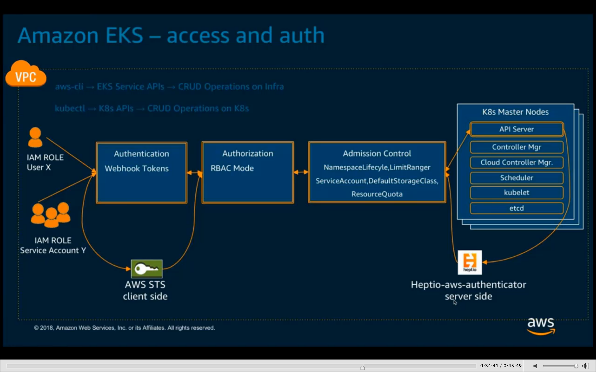
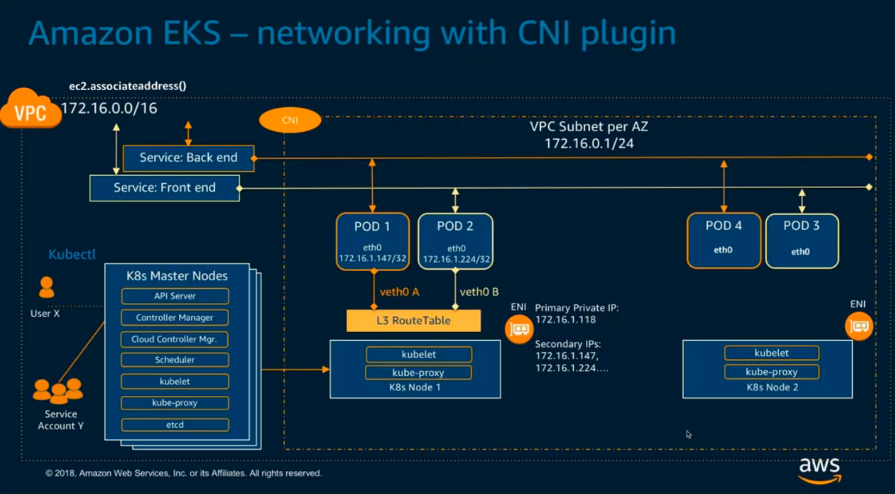
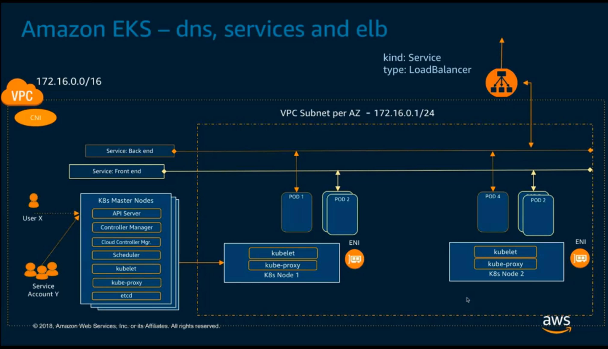
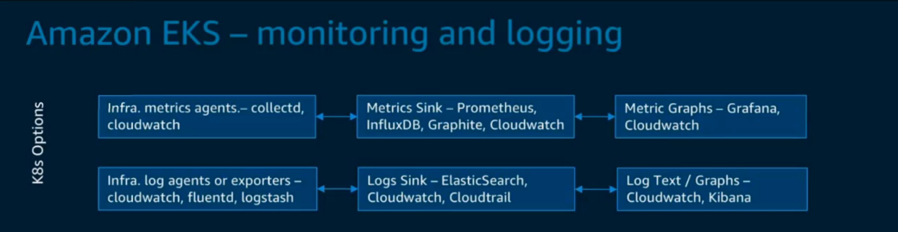
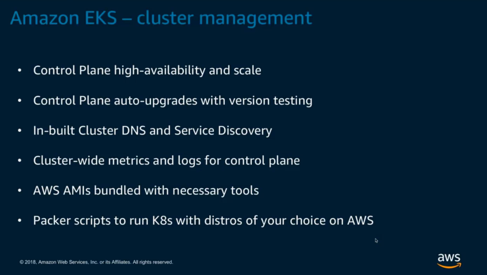
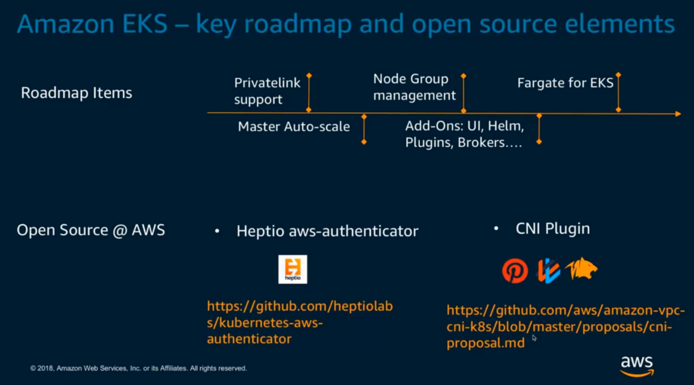

# k8s-eks-webinar
Notes

63% of K8s workloads run on AWS - CNCF survey

Question: when is the official GA of EKS planned?
Hey Paul, we know this is top of everyone's minds. we're hard at work getting the service ready for GA! However, we can't comment on dates, apologies.

EKS not HIPAA compliant
Pricing not yet announced for EKS
EKS - no API server customization
Spot Fleet works the same in EKS as it does in upstream Kubernetes- it's supported out of the box. Kubernetes just uses EC2 Tags and Kubernetes labels to identify the resources. 

k8s @ SAP - multi cluster (v1)

Skipper - github.com/concur/skipper
k8s Deployment API

Can you attach IAM roles/policies at the container level similar to how ECS works?
This is supported in open source Kubernetes today. Kube2IAM is one such project that attempts to implemet this. However, there isn't an AWS built mechanism for this today. 

EKS manages upgrades of the Kubernetes control plane, including etcd.
Auto Scaling Groups are supported for worker nodes.

Network policies will be supported via integration with Calico.
Network Load Balancers are supported in Kubernetes 1.9. Private Link Endpoints will be available, as well.

Configure VPC and EKSServiceRole
Configure kubectl and awscli

RBAC integrated with IAM

They are doing a ton of setup during the demo (compared to kops)...

Simplify networking options
Reuse - VPC flow logs troubleshooting, routing policies, sg for isolation
Support cluster scale to min 5000+

Tigera partnership - stage separation, tenant separation, fine-grained firewalls, compliance

EKS GA - Cluster-wide Cloudwatch metrics and Cloudtrail logs
For node groups - EKS roadmap
Application container metrics/logs - customer configured

## Slides

